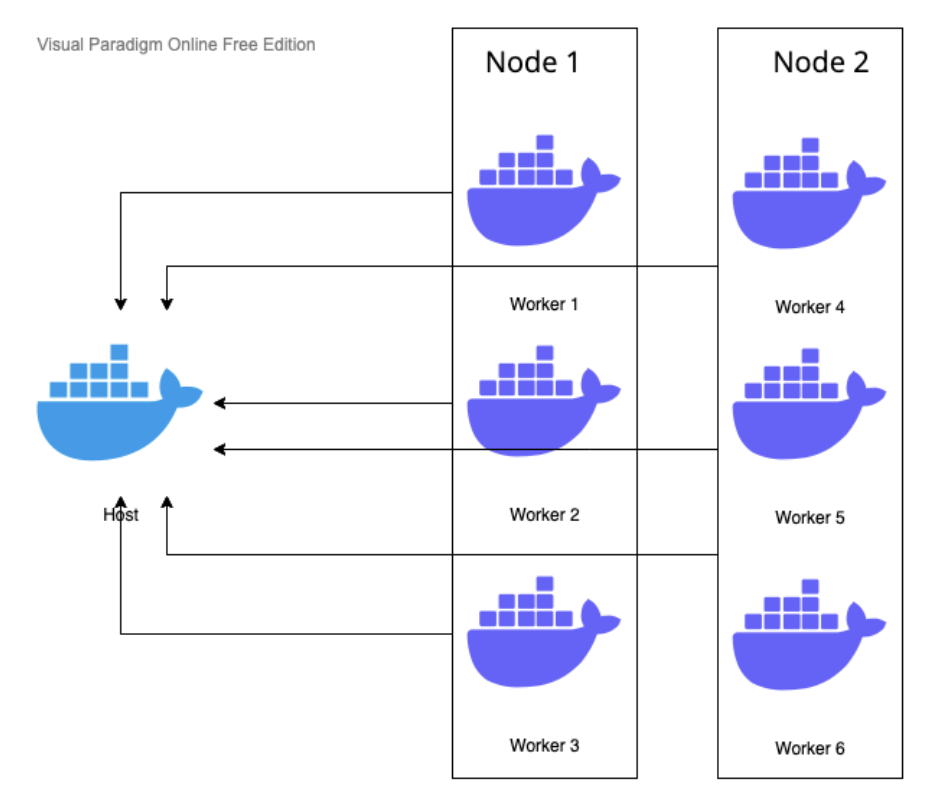
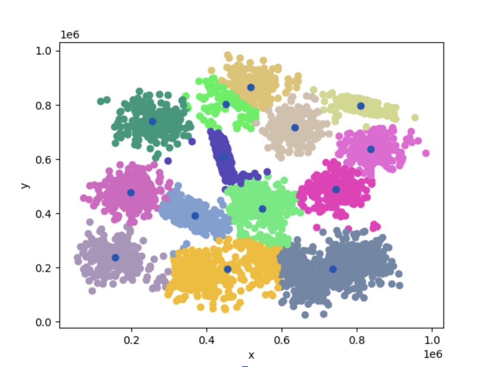
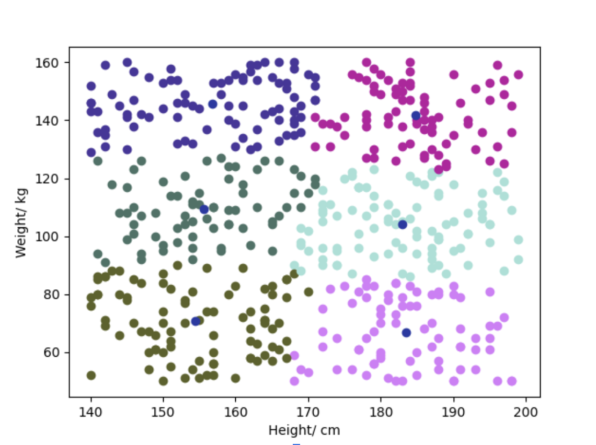
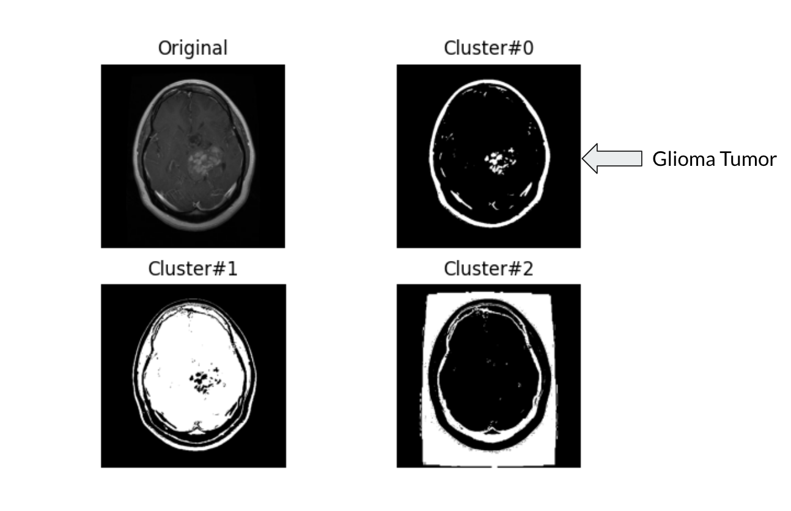

# PDKMeans
PDKMeans is a parallel distributed K-Means algorithm implementation of  research paper by Benchara, Fatéma Zahra, and Mohamed Youssfi. 2021. “A New Scalable Distributed K-Means Algorithm  Based on Cloud Micro-Services for High-Performance Computing.” Parallel Computing 101 (April): 102736. https://doi.org/10.1016/j.parco.2020.102736. 

# Software Architecture


# Clustering Synthetic data


# Clustering BMI data


# Brain MRI Image Segmentation


# Usage
## Clean Build Docker

```shell
docker-compose build --force-rm
```

*Note: You might need to add sudo before docker*

## Start Host and Worker (# of worker 3) docker

```shell
docker-compose up --scale worker=3
```

## Login to host docker container

```shell
docker exec -it pdkmeans_host_1 bash
```

## Submit new job to host (k e path)

```shell
python3 submit.py 3 0 data/500_Person_Gender_Height_Weight_Index.csv
```

```shell
python3 submit.py 3 0 data/mri-2.jpg
```

## Copy output plot to local

```shell
docker cp pdkmeans-host-1:/opt/app/output.png .
```
